<!-- ===== HEADER BANNER ===== -->
<div align="center">
  
</div>

<!-- ===== MATRIX TYPING ANIMATION ===== -->
<div align="center">
  <a href="https://git.io/typing-svg">
    
  </a>
</div>

<!-- ===== NEON STATUS BADGES ===== -->
<div align="center">
  <br>
  <a href="https://eruditedigital.com">
    
  </a>
  &nbsp;
  <a href="https://strathmore.edu">
    
  </a>
  &nbsp;
  
  <br><br>
  
  &nbsp;
  
  &nbsp;
  
</div>

<br>

<!-- ===== SNAKE ANIMATION ===== -->


<br>

<!-- ===== DIVIDER ===== -->


<!-- ===== ABOUT ME ===== -->
<h2 align="center">
  
  &nbsp; WHO AM I &nbsp;
  
</h2>

<div align="center">

<table>
<tr>
<td valign="top" width="50%">

### 🧬 Quick Bio
<br>
<br>
<br>
<br>
<br>
<br>

<br>

### ⚡ Right Now
```bash
$ whoami
> Shalom Obongo — Builder & Problem Solver

$ cat current_focus.txt
> ✦ Shipping web & mobile products @ Erudite Digital
> ✦ Automating enterprise workflows w/ Power Platform
> ✦ Exploring AI/ML integrations in real-world apps
> ✦ Finishing BSc Computer Science @ Strathmore (Dec 2025)
```

</td>
<td valign="top" width="50%">

### 📊 By The Numbers

<div align="center">

| | |
|:---:|:---:|
|  |  |
|  |  |
|  |  |

</div>

<br>

### 🎯 Core Strengths
<div align="center">
  &nbsp;
  <br><br>
  &nbsp;
  <br><br>
  &nbsp;
  
</div>

</td>
</tr>
</table>

</div>

<table align="center">
  <tr>
    <td width="50%" align="center">
      
    </td>
    <td width="50%" align="center">
      
    </td>
  </tr>
</table>


<!-- ===== PROFESSIONAL PROFILE CODE BLOCK ===== -->
<details>
<summary>
<h2 align="center">
  
  &nbsp; PROFESSIONAL PROFILE — click to expand &nbsp;
  
</h2>
</summary>

<div align="center">

```typescript
const shalomObongo: Developer = {
  // ─────────────────────────────────────────────────────
  //  IDENTITY
  // ─────────────────────────────────────────────────────
  name:     "Shalom Obongo",
  title:    "Full Stack & Mobile Developer | Process Automation Specialist",
  location: "Nairobi, Nairobi County, Kenya 🇰🇪",
  education: {
    degree:      "Bachelor of Science in Computer Science",
    institution: "Strathmore University",
    period:      "Feb 2022 – Dec 2025",
  },

  // ─────────────────────────────────────────────────────
  //  EXPERIENCE
  // ─────────────────────────────────────────────────────
  experience: [
    {
      role:    "Full Stack Developer",              // ◄── CURRENT
      company: "Erudite Digital",
      period:  "March 2024 – Present",
      stack:   ["Next.js", "Node.js", "TypeScript", "React"],
      impact:  [
        "Delivering tailored software solutions for local businesses",
        "Managing client relationships & aligning tech strategy with goals",
        "End-to-end project lifecycle: scoping → development → delivery",
      ],
    },
    {
      role:    "Lead Application Developer",
      company: "Momentum Labs",
      period:  "Nov 2024 – May 2025",
      stack:   ["React Native", "Expo", "Firebase"],
      impact:  [
        "Initiated & led AfroNative — African language preservation app",
        "Oversaw full dev lifecycle: UI/UX → implementation → testing",
        "Mentored interns; defined roles & maintained team productivity",
      ],
    },
    {
      role:    "Automations Dev & IT Assistant",
      company: "Letshego Kenya",
      period:  "Jan 2025 – Apr 2025",
      stack:   ["Power Apps", "Power Automate", "Microsoft 365"],
      impact:  [
        "Designed automated form-processing workflows, reducing manual effort",
        "Configured & deployed devices into enterprise IT infrastructure",
        "Maintained IT asset inventory & provided daily technical support",
      ],
    },
    {
      role:    "Machine Learning Intern",
      company: "HubbleMind",
      period:  "Dec 2024",
      stack:   ["Python", "scikit-learn", "pandas", "NumPy", "Seaborn"],
      impact:  [
        "Built obesity-level estimator — 91% prediction accuracy",
        "End-to-end ML pipeline: EDA → preprocessing → modelling → eval",
      ],
    },
    {
      role:    "Technology Consultant",
      company: "Calm&Zest Enterprises",
      period:  "Jan 2022 – Jan 2025",
      stack:   ["React", "Firebase", "POS Systems"],
      impact:  [
        "Led tech-driven transformation of bottled water business",
        "Implemented POS systems & customer-feedback mechanisms",
      ],
    },
  ],

  // ─────────────────────────────────────────────────────
  //  SKILLS & CERTIFICATIONS
  // ─────────────────────────────────────────────────────
  topSkills: [
    "Leading Development Teams",
    "Mobile Software Development",
    "Microsoft Power Apps",
    "Process Automation",
    "UI/UX Design",
  ],
  certifications: ["CCNA", "Cybersecurity", "Python"],
  languages:      ["English 🇬🇧", "Swahili 🇰🇪", "Chinese 🇨🇳"],

  // ─────────────────────────────────────────────────────
  //  CONTACT
  // ─────────────────────────────────────────────────────
  contact: {
    email:    "shalomobongo@yahoo.com",
    phone:    "+254 797 083 441",
    linkedin: "linkedin.com/in/shalom-obongo",
  },
};
```

</div>
</details>


<!-- ===== TECH STACK ===== -->
<h2 align="center">
  
  &nbsp; TECH ARSENAL &nbsp;
  
</h2>

<div align="center">

  <h3>⚡ Frontend & Frameworks</h3>
  <br><br>

  <h3>🛠️ Backend & Databases</h3>
  <br><br>

  <h3>📱 Mobile Development</h3>
  
  &nbsp;
  
  <br><br>

  <h3>🤖 AI / ML</h3>
  
  &nbsp;
  
  
  <br><br>

  <h3>⚙️ Automation & Enterprise</h3>
  
  
  
  <br><br>

  <h3>☁️ Cloud & DevOps</h3>
  <br><br>

  <h3>🎨 Design & Tools</h3>
  <br>

</div>


<!-- ===== CERTIFICATIONS ===== -->
<h2 align="center">
  
  &nbsp; CERTIFICATIONS &nbsp;
  
</h2>

<div align="center">
  <table>
    <tr>
      <td align="center" width="33%">
        <br>
        <sub>Cisco Certified Network Associate</sub><br>
        <sub>Intro to Networks · 2023</sub>
      </td>
      <td align="center" width="33%">
        <br>
        <sub>Cybersecurity Fundamentals</sub><br>
        <sub>Threat Detection &amp; Network Defence</sub>
      </td>
      <td align="center" width="33%">
        <br>
        <sub>Python 3 Programming</sub><br>
        <sub>Codecademy · 2022</sub>
      </td>
    </tr>
  </table>
</div>


<!-- ===== PROJECTS ===== -->
<h2 align="center">
  
  &nbsp; SIGNATURE PROJECTS &nbsp;
  
</h2>

<div align="center">
  <table>
    <tr>
      <!-- Job-Easy -->
      <td width="50%" valign="top">
        <h3 align="center">🤖 Job-Easy</h3>
        <div align="center">
          
          
          <br><br>
          <a href="https://github.com/ShalomObongo/Job-Easy">
            
          </a>
          <br><br>
          
          
          
          
          <br>
          <p align="left"><sub>End-to-end AI job application engine. Scrapes Greenhouse, Lever, Workday, LinkedIn &amp; Indeed → scores fit (40% skills / 25% experience / 15% education) → auto-generates tailored résumé + cover letter PDFs → submits applications via Browser Use automation. 9-module architecture with YOLO mode &amp; batch processing.</sub></p>
        </div>
      </td>
      <!-- czest-analytics -->
      <td width="50%" valign="top">
        <h3 align="center">📊 czest-analytics</h3>
        <div align="center">
          
          
          <br><br>
          <a href="https://czest-analytics.vercel.app" target="_blank">
            
          </a>
          <a href="https://github.com/ShalomObongo/czest-analytics">
            
          </a>
          <br><br>
          
          
          
          
          <br>
          <p align="left"><sub>Enterprise analytics platform for Calm&amp;Zest water company. Multi-store management, real-time inventory tracking (bottles &amp; dispensers), AI-powered trend detection, delivery system, NextAuth auth. Built with Next.js 13, Radix UI &amp; Tailwind.</sub></p>
        </div>
      </td>
    </tr>
    <tr>
      <!-- QuantumFile -->
      <td width="50%" valign="top">
        <h3 align="center">🌌 QuantumFile</h3>
        <div align="center">
          
          
          <br><br>
          <a href="https://github.com/ShalomObongo/QuantumFile">
            
          </a>
          <br><br>
          
          
          
          
          <br>
          <p align="left"><sub>AI-powered desktop file organiser. Gemini API analyses your file contents &amp; names, suggests a categorised folder structure, lets you preview changes, then applies the reorganisation with auto-backup — all inside a native Electron + React UI.</sub></p>
        </div>
      </td>
      <!-- QuanTerminal -->
      <td width="50%" valign="top">
        <h3 align="center">⚡ QuanTerminal</h3>
        <div align="center">
          
          
          <br><br>
          <a href="https://github.com/ShalomObongo/QuanTerminal">
            
          </a>
          <br><br>
          
          
          
          <br>
          <p align="left"><sub>Natural language → terminal command translator powered by Groq Llama 3.3 70B. Context-aware: detects Node, Python, Docker, Rust &amp; Go projects, Git status, and active shell type. Installs as a global <code>ai "..."</code> command — describe what you want, get the exact command.</sub></p>
        </div>
      </td>
    </tr>
    <tr>
      <!-- quantum-pay-daraja -->
      <td width="50%" valign="top">
        <h3 align="center">💳 quantum-pay-daraja</h3>
        <div align="center">
          
          
          <br><br>
          <a href="https://github.com/ShalomObongo/quantum-pay-daraja">
            
          </a>
          <br><br>
          
          
          
          
          <br>
          <p align="left"><sub>Production-ready M-PESA payment integration built on Next.js 13 &amp; Safaricom Daraja 2.0 API. STK Push initiation, real-time transaction status tracking, dark/light mode UI. Forked by the community — a go-to starter for Kenyan fintech integrations.</sub></p>
        </div>
      </td>
      <!-- ML Obesity Predictor -->
      <td width="50%" valign="top">
        <h3 align="center">🧠 ML Obesity Predictor</h3>
        <div align="center">
          
          
          <br><br>
          <a href="https://github.com/ShalomObongo/ML-Obesity-Predictor">
            
          </a>
          <br><br>
          
          
          
          <br>
          <p align="left"><sub>End-to-end ML pipeline for multi-class obesity level estimation. EDA → feature encoding → outlier detection → Logistic Regression vs Random Forest comparison. 91% accuracy across 2,111 records. Built @ HubbleMind internship.</sub></p>
        </div>
      </td>
    </tr>
    <tr>
      <!-- AfroNative -->
      <td width="50%" valign="top">
        <h3 align="center">🌍 AfroNative</h3>
        <div align="center">
          
          
          <br><br>
          
          
          
          <br>
          <p align="left"><sub>Mobile app preserving &amp; promoting native African languages through modern interactive learning tools. Led full lifecycle — feature planning, UI/UX alignment, team mentorship, testing &amp; delivery @ Momentum Labs.</sub></p>
        </div>
      </td>
      <!-- Student-Zone -->
      <td width="50%" valign="top">
        <h3 align="center">🎓 Student-Zone</h3>
        <div align="center">
          
          
          <br><br>
          <a href="https://studentszone.vercel.app" target="_blank">
            
          </a>
          <a href="https://github.com/ShalomObongo/Student-Zone">
            
          </a>
          <br><br>
          
          
          
          <br>
          <p align="left"><sub>AI-powered academic platform built on Next.js. Smart study tools, personalised learning experiences, and real-time student collaboration — live at studentszone.vercel.app.</sub></p>
        </div>
      </td>
    </tr>
  </table>
</div>


<!-- ===== TROPHIES ===== -->
<h2 align="center">🏆 GITHUB TROPHIES</h2>

<div align="center">
  
</div>


<!-- ===== ACTIVITY GRAPH ===== -->
<h2 align="center">
  
  &nbsp; CODING ACTIVITY &nbsp;
  
</h2>

<div align="center">
  
  <br>
  
</div>


<!-- ===== SKILLS MATRIX ===== -->
<h2 align="center">⚡ SKILLS MATRIX</h2>

<div align="center">
  <table>
    <thead>
      <tr>
        <th>Domain</th>
        <th>Level</th>
        <th>Technologies</th>
      </tr>
    </thead>
    <tbody>
      <tr>
        <td>🖥️ Frontend</td>
        <td></td>
        <td>Next.js · React · TypeScript · Tailwind CSS · Vue</td>
      </tr>
      <tr>
        <td>⚙️ Backend</td>
        <td></td>
        <td>Node.js · Express · Python · REST APIs · GraphQL</td>
      </tr>
      <tr>
        <td>📱 Mobile</td>
        <td></td>
        <td>React Native · Expo · Flutter · iOS · Android</td>
      </tr>
      <tr>
        <td>🤖 Automation</td>
        <td></td>
        <td>Power Apps · Power Automate · Workflow Design</td>
      </tr>
      <tr>
        <td>🧠 AI / ML</td>
        <td></td>
        <td>scikit-learn · TensorFlow · Gemini API · Groq</td>
      </tr>
      <tr>
        <td>☁️ Cloud</td>
        <td></td>
        <td>AWS · GCP · Docker · Kubernetes · Firebase</td>
      </tr>
      <tr>
        <td>🔐 Security</td>
        <td></td>
        <td>CCNA Networking · Cybersecurity Fundamentals</td>
      </tr>
      <tr>
        <td>👥 Leadership</td>
        <td></td>
        <td>Team Lead · Mentorship · Project Management · Agile</td>
      </tr>
    </tbody>
  </table>
</div>


<!-- ===== CONNECT ===== -->
<h2 align="center">
  
  &nbsp; LET'S CONNECT &nbsp;
  
</h2>

<div align="center">
  <a href="https://www.linkedin.com/in/shalom-obongo" target="_blank">
    
  </a>
  &nbsp;
  <a href="mailto:shalomobongo@yahoo.com">
    
  </a>
  &nbsp;
  <a href="tel:+254797083441">
    
  </a>
  <br><br>
  <a href="https://eruditedigital.com" target="_blank">
    
  </a>
</div>

<br>

<!-- ===== LANGUAGES ===== -->
<div align="center">
  <h3>🌐 Spoken Languages</h3>
  
  &nbsp;
  
  &nbsp;
  
</div>

<br>

<!-- ===== QUOTE ===== -->
<div align="center">
  
</div>

<br>

<!-- ===== EASTER EGG ===== -->
<details>
<summary>🎁 You found a secret...</summary>
<br>
<div align="center">
  
  <h3>Thanks for making it to the bottom! 🙌</h3>
  <p>Whether you're a recruiter, collaborator, or fellow dev — let's build something amazing.<br>
  Drop me a message at <strong>shalomobongo@yahoo.com</strong> or connect on LinkedIn.</p>
</div>
</details>

<!-- ===== FOOTER BANNER ===== -->

